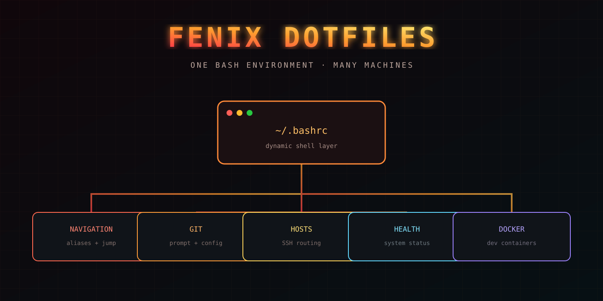
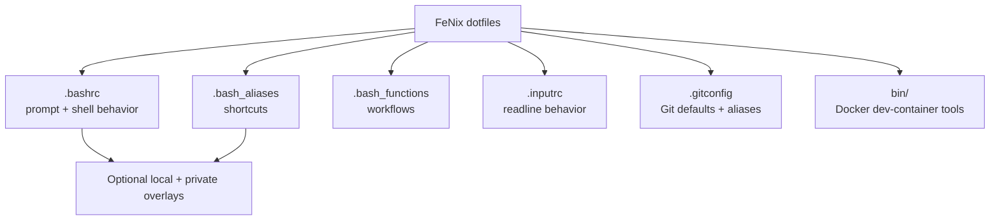
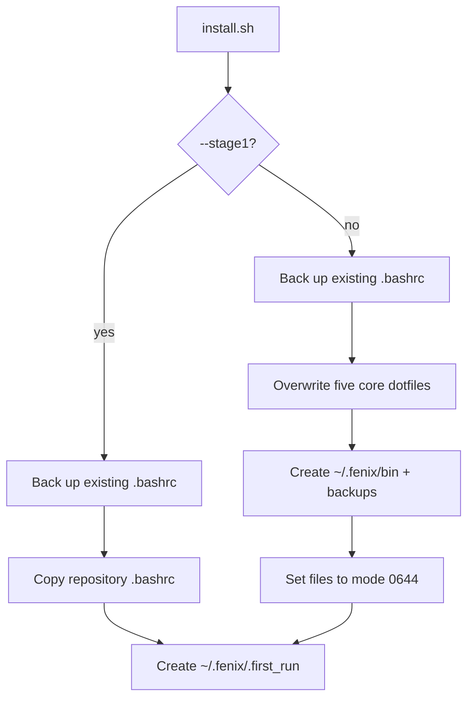
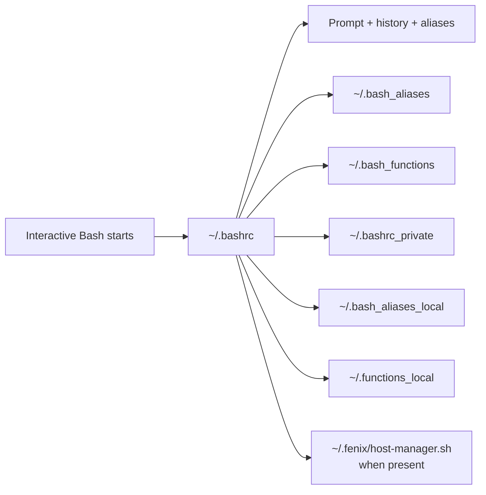
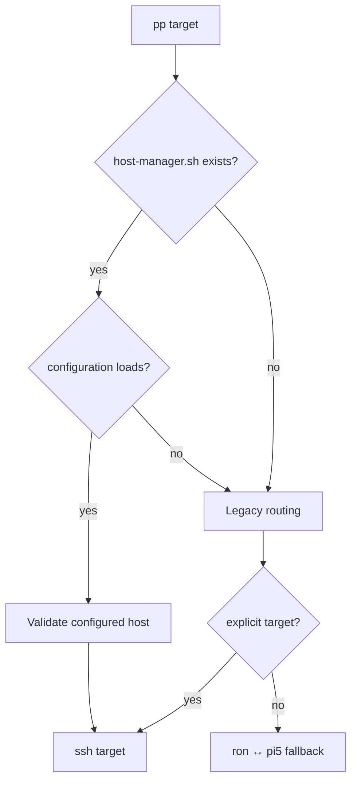
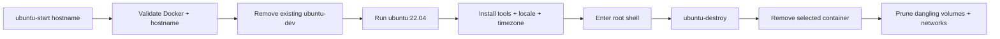

<p align="center"></p>

<h1 align="center">FeNix Public Dotfiles</h1>

<p align="center"><strong>A portable, opinionated Bash environment for interactive Linux shells, multi-host work, and disposable Docker tooling.</strong></p>

> [!CAUTION]
> Full installation replaces `~/.bashrc`, `~/.bash_aliases`, `~/.bash_functions`, `~/.inputrc`, and `~/.gitconfig`. Only the existing `.bashrc` is backed up automatically. Review and back up every destination before installing.

## What is in this repository



The shell layer adapts to available commands and common project directories, displays Git context in the prompt, exposes system/network helpers, and optionally loads host-management and private/local override files.

## Installation status

Earlier documentation directed users to a bootstrap in `nixfred/fenix`. That repository has since evolved into a different Distrobox utility and no longer contains the referenced bootstrap. Do **not** use the stale curl command.

The current installation route is manual and should be treated as a dotfile migration:

```bash
git clone https://github.com/nixfred/fenix-dotfiles.git ~/.fenix/dotfiles
cd ~/.fenix/dotfiles

# Inspect the source and destination set first
less install.sh
git diff --no-index ~/.bashrc .bashrc || true
```

Back up all affected files:

```bash
backup_dir="$HOME/dotfiles-backup-$(date +%Y%m%d-%H%M%S)"
mkdir -p "$backup_dir"
for file in .bashrc .bash_aliases .bash_functions .inputrc .gitconfig; do
  [ -e "$HOME/$file" ] && cp -a "$HOME/$file" "$backup_dir/"
done
printf 'Backups: %s\n' "$backup_dir"
```

Then choose one install level.

### Stage 1: `.bashrc` only

```bash
./install.sh --stage1
```

### Full dotfile copy

```bash
./install.sh
```

Open a new shell after installation. Sourcing `.bashrc` in the current shell immediately changes aliases, functions, prompt behavior, history handling, and command resolution.

## Installation flow



The installer creates `~/.fenix/bin` but does not copy `bin/ubuntu-start` or `bin/ubuntu-destroy` into it. They become available automatically only while the clone remains at `~/.fenix/dotfiles`, because `.bashrc` adds that repository's `bin` directory to `PATH`.

## Shell composition



Local and private overlay files are optional and are not included here. Because they are sourced as shell code, protect their ownership and contents.

## Major workflows

| Area | Examples | Boundary |
| --- | --- | --- |
| Navigation | `j proj`, `..`, `home`, directory aliases | Changes the current shell directory |
| Git | branch-aware prompt and numerous aliases | `.gitconfig` replaces global Git behavior |
| Packages/system | `si`, `aa`, `reboot`, `sysfix` | Some aliases invoke `sudo` and make broad system changes |
| Hosts | `pp`, `pp-all`, `pp-role` | Executes SSH sessions or arbitrary commands on configured hosts |
| Monitoring | `neo`, `memtop`, `ports`, log helpers | Availability varies by distribution and installed tools |
| Docker | shorthand aliases and dev-container scripts | Can create, replace, prune, or destroy containers and resources |

The project describes broad distribution portability, but several defaults are Debian/Ubuntu-specific (`apt`, `/var/log/syslog`, `journalctl -u ssh`) or expect optional tools. Test on each target environment rather than assuming feature parity.

## Multi-host routing



Without a host manager, `pp` retains hard-coded legacy defaults for `ron` and `pi5`. Review those names before using it on an unrelated machine. `pp-all` and `pp-role` execute the supplied command remotely across host sets; quote commands carefully and use only trusted configuration.

## Docker development container

[`bin/ubuntu-start`](bin/ubuntu-start) creates a fixed container named `ubuntu-dev`, replacing any existing container with that name without an interactive confirmation. It uses Ubuntu 22.04, installs more than 40 packages, applies an optional repository `.bashrc`, and enters a root shell.



`ubuntu-destroy` lists running containers and asks which to remove, but it automatically prunes all dangling Docker volumes and networks afterward. Treat both commands as host-mutating utilities, not harmless shell cosmetics.

## Repository map

```text
.
├── .bashrc                   # Primary interactive shell configuration
├── .bash_aliases             # Alias collection
├── .bash_functions           # Reusable shell functions
├── .inputrc                  # Readline configuration
├── .gitconfig                # Installed global Git configuration
├── .gitconfig_public         # Alternate historical public config
├── install.sh                # Stage-1 and full copy installer
├── bin/
│   ├── ubuntu-start          # Recreate/bootstrap ubuntu-dev
│   └── ubuntu-destroy        # Select/remove and prune
├── assets/readme-hero.svg    # README title artwork
├── CLAUDE.md                 # Historical maintainer guidance
└── README.md
```

## Validate changes

```bash
for file in install.sh .bashrc .bash_aliases .bash_functions bin/ubuntu-start bin/ubuntu-destroy; do
  bash -n "$file"
done
```

Syntax checks do not prove portability or safety. Test installation with a disposable home directory and test Docker commands on a dedicated Docker host with no valuable containers or dangling volumes.

## License status

This repository contains no license file. Public visibility does not grant reuse rights.

---

<p align="center"><strong>Portable shell power—with every side effect made visible.</strong></p>
